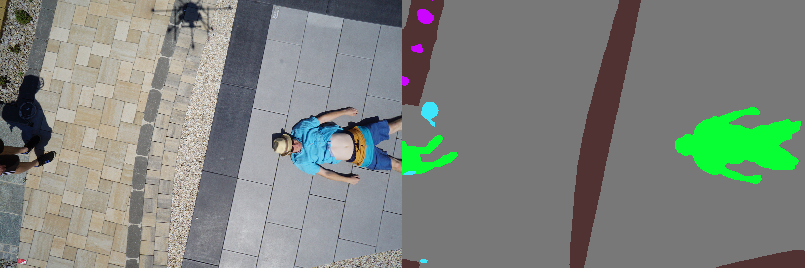
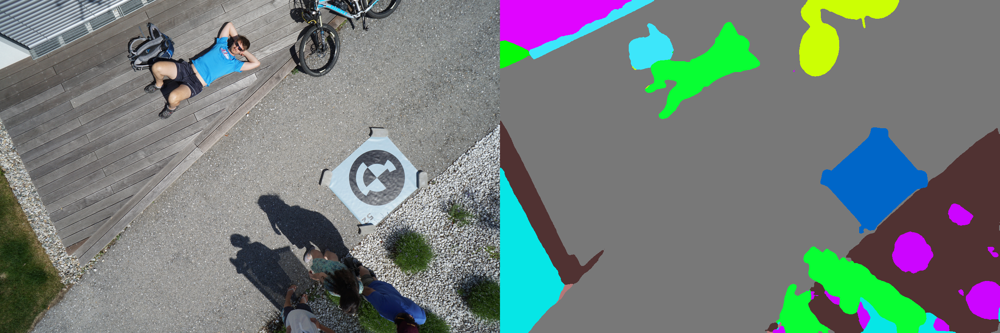
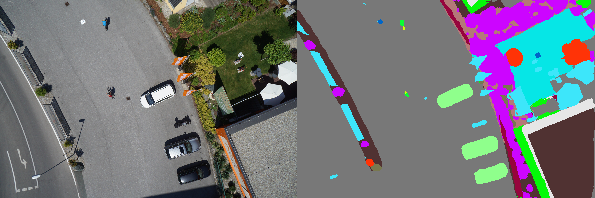
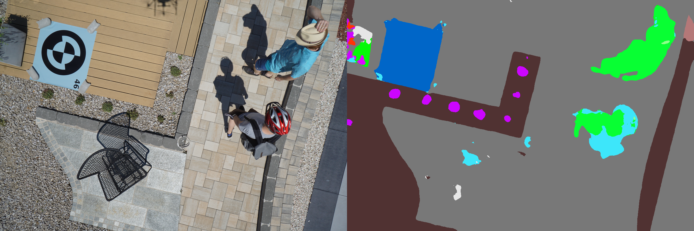
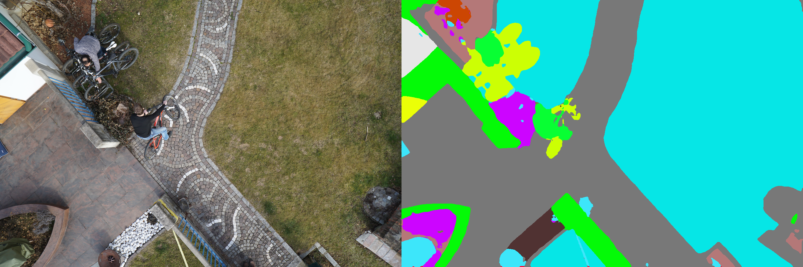
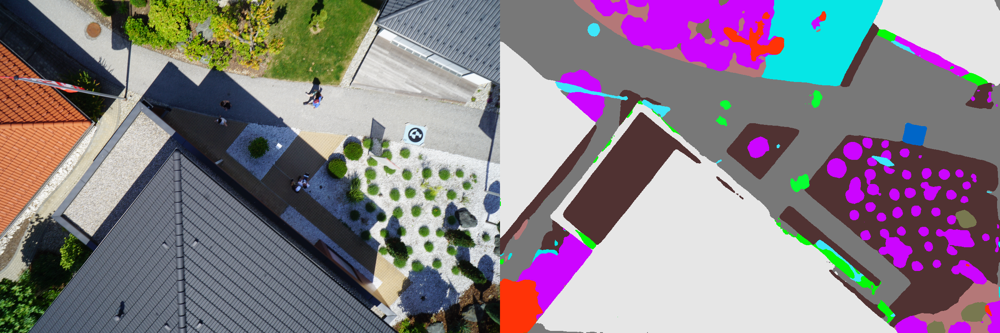
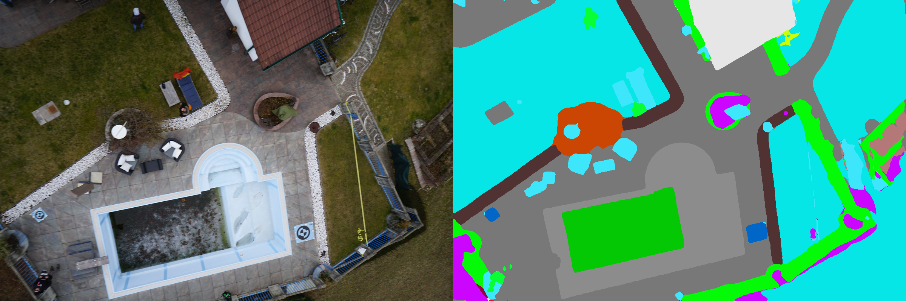

# Semantic Segmentation on aerial (drone) images

You can use this repo to generate semantic segmentations on drone images. The model was trained using publicly available [Semantic Drone Dataset](http://dronedataset.icg.tugraz.at/). For training, I trained the model on HRNet using the amazing CSAIL Vision's [semantic segmentation pipeline](https://github.com/CSAILVision/semantic-segmentation-pytorch).  
I trained the model on Google Colab. If you want to train your own models on colab using this pipeline, please see the [train_on_colab.ipynb](train_on_colab.ipynb) notebook. Note that we will be saving all the checkpoints on Google drive, as the files are deleted everytime colab environment is reset. For longer trainings, don't save checkpoint for every epoch, as it can fill up your google drive quickly.

### Some Results on validation data
    
    
    
    
    
    

 
 
### Usage:
You can use the trained model to get results on your custom images.  
Step 1: clone the CSAIL Vision's [semantic segmentation pipeline](https://github.com/CSAILVision/semantic-segmentation-pytorch).  
Step 2: Edit the HRNet config file in the cloned repo (config/ade20k-hrnetv2.yaml). Or use the [one in this repo](./config/aerial-sseg.yaml).  
Step 3: Update the checkpoint path in config file. Use the chekpoint present in the checkpoint folder.  
Step 4: Run the CSAIL Vision's test.py: python test.py --gpu 0 --cfg path-to-config-file --imgs path-to-images-directory
